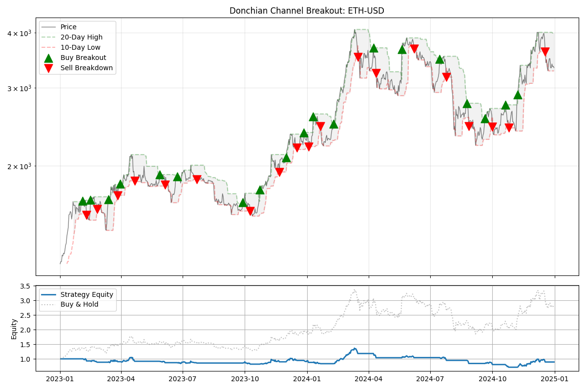
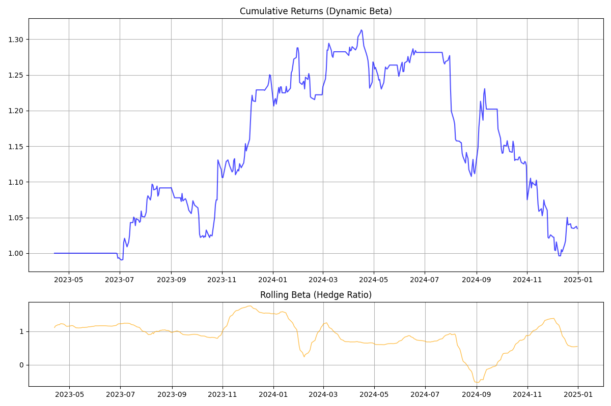

# Quantitative Trading Strategies Framework


## 📌 Overview
A modular, event-driven backtesting engine for financial trading strategies. This framework provides clear separation between data handling, strategy logic, execution simulation, and performance analytics.

Designed for quantitative research, allowing for rapid testing of technical signals (SMA, EMA, RSI) and risk metrics.

## 🚀 Features

* **Event-Driven Architecture:** Simulates realistic execution with `DataHandler`, `Strategy`, and `Portfolio` classes.
* **Vectorized Indicators:** Optimized SMA, EMA, MACD, and RSI calculations using Pandas/Numpy.
* **Risk Management:** Built-in calculation of Sharpe Ratio, and Maximum Drawdown.
* **CI/CD Integration:** GitHub Actions enabled for automated testing.

## 📂 Project Structure
```
.
├── docs/                               # Comprehensive documentation files
│   └── strategies.md                   # Detailed descriptions of all trading strategies
├── src/                                # Source code for strategies and core logic
│   └── backtest_strategies/
│       ├── strategies/                 # Strategy logic (SMA, RSI, Pairs, etc.)
│       ├── run_pairs.py                # Runner for Pairs Trading backtests
│       ├── run.py                      # Main runner for single-asset strategies
│       └── ...
│   └── vectorized_strategies/          # 🐇 VECTORIZED ENGINE (Pandas/NumPy)
│       ├── sma_strategy.py             # Strategies (included sma, ema, mean_reversion, donchain channel)
│       └── ...
├── tests/                              # Unit and integration tests
├── results/                            # Visualizations
├── .gitignore                       
├── LICENSE
├── README.md          
└── requirements.txt
```

### Installation

1.  **Clone the repository:**
```bash
git clone https://github.com/eddiesung111/quantitative-trading-strategies.git
cd quantitative-trading-strategies
```

2.  **Create and activate a virtual environment:**
Before installing any packages or running scripts, you must activate the virtual environment.

* On macOS / Linux:
```bash
python3 -m venv .venv
source .venv/bin/activate
```

* On Windows (PowerShell):
```powershell
python -m venv .venv
.venv\Scripts\Activate.ps1
```

3.  **Install project dependencies:**
```bash
pip install -r requirements.txt
```

## 🧠 Strategies Implemented
This framework includes the following trading strategies. For detailed logic and parameters, refer to [docs/strategies.md](https://github.com/eddiesung111/quantitative-trading-strategies/blob/main/docs/strategies.md).

### 🐢 Event-Driven Strategies (Backtrader)
*Located in `src/backtest_strategies/`*
| Strategy | Description |
| :--- | :--- |
| **BuyHold** | Benchmark strategy; buy once and hold. |
| **SMAGoldenCross** | Golden Cross using Simple Moving Averages. |
| **EMAGoldenCross** | Golden Cross using Exponential Moving Averages. |
| **MACDStrategy** | Momentum trading using MACD histogram/signal crossovers. |
| **RSIStrategy** | Overbought/Oversold mean reversion using RSI. |
| **PairsTrading** | Statistical Arbitrage trading the spread between cointegrated assets. |

### 🐇 Vectorized Strategies (Pandas)
*Located in `src/vectorized_strategies/`*
| Strategy | Description |
| :--- | :--- |
| **SMA Strategy** | Fast calculation of SMA crossovers across large datasets. |
| **EMA Strategy** | Fast calculation of EMA crossovers. |
| **Mean Reversion** | Bollinger Band-based logic calculated vectorially. |
| **Donchian Channel** | Breakout logic using rolling max/min calculations. |

## 🏃 Run the Program
This framework supports two different backtesting engines. Choose the one that fits your needs:

### 🐢 Option 1: Event-Driven Engine (Backtrader)
*Best for: Realistic simulations, handling order execution, slippage, and complex logic (e.g., Pairs Trading).*

**1. Run Standard Strategies (SMA, RSI, Mean Reversion):**
```bash
python src/backtest_strategies/run.py [StrategyName]
```
Available Strategies: `BuyHold`, `SMAGoldenCross`, `EMAGoldenCross`, `MACDStrategy`, `RSIStrategy`

**2. Run Pairs Trading (Statistical Arbitrage):**
To execute the cointegration-based pairs trading engine:
```bash
python3 src/backtest_strategies/run_pairs.py
```

### 🐇 Option 2: Vectorized Engine (Pandas/NumPy)
Best for: Rapid prototyping, researching theoretical signals, and analyzing thousands of scenarios in seconds.
To run the lightweight, fast backtester:
```bash
python src/vectorized_strategies/[Strategy file name]
```
Available Strategies: `sma_strategy.py`, `mean_reversion.py`, `ema_strategy.py`, `donchain_channel.py`

#### Results
1. Donchain Channel Strategy

Example output:
```text
--- RESULTS: ETH-USD ---
Total Trades: 38
Sharpe Ratio: 0.01
Max Drawdown: -47.71%
Strategy Return: -10.74%
```
Visualizes the Cumulative Return and Price Movement (including signals).


2. Mean Reversion Strategy

Example output:
```text
--- ADAPTIVE STRATEGY RESULTS ---
Total Trades:    16
Sharpe Ratio:    0.21
Max Drawdown:    -24.12%
Strategy Return: 3.45%
```


## ✅ Testing
The project includes a test suite to ensure the correctness and reliability of the strategies and core components.
To run all tests:
```bash
pytest
```

## 📚 Documentation
For more in-depth information, please refer to the docs/ directory:
* [**Strategies**](https://github.com/eddiesung111/quantitative-trading-strategies/blob/main/docs/strategies.md): Comprehensive details on each implemented trading strategy.
